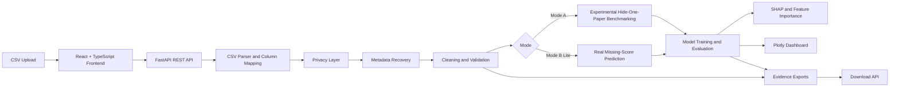

# Predicting Missing Examination Component Scores

<p align="center">
  <strong>Privacy-preserving, explainable machine learning for missing examination component score prediction.</strong>
</p>

<p align="center">
  
  
  
  
  
  
  
  
  
  
  
</p>

<p align="center">
  <a href="https://ada-data-science-capstone.onrender.com/"><strong>Live Demo</strong></a>
  &nbsp;|&nbsp;
  <a href="https://ada-data-science-capstone.onrender.com/api/health"><strong>Health Endpoint</strong></a>
  &nbsp;|&nbsp;
  <a href="https://github.com/basil-emeokoro/ADA-Data-Science-Capstone"><strong>GitHub Repository</strong></a>
</p>

## Table of Contents

- [Overview](#overview)
- [Features](#features)
- [System Architecture](#system-architecture)
- [Technology Stack](#technology-stack)
- [Installation](#installation)
- [Usage](#usage)
- [Live Demo](#live-demo)
- [API Endpoints](#api-endpoints)
- [Screenshots](#screenshots)
- [Project Structure](#project-structure)
- [Privacy Model](#privacy-model)
- [Examination Paper Rules](#examination-paper-rules)
- [Explainability](#explainability)
- [Training and Validation Strategy](#training-and-validation-strategy)
- [Export Process](#export-process)
- [Deployment](#deployment)
- [Notebook](#notebook)
- [Submission Package](#submission-package)
- [Troubleshooting](#troubleshooting)
- [Reproducibility Notes](#reproducibility-notes)
- [Future Improvements](#future-improvements)
- [License](#license)
- [Author](#author)

## Overview

High-stakes examination datasets can contain incomplete paper component scores caused by missing scripts, data-entry gaps, absences, or operational irregularities. In these settings, prediction must be handled carefully: models need valid metadata, privacy protection, transparent evaluation, and defensible explanations.

This project implements a capstone-grade machine learning web application for predicting missing examination component scores and benchmarking regression models under controlled research conditions. It solves two related problems:

- **Research benchmarking:** deliberately hide known scores, train multiple models, compare predictions against actual values, and generate report-ready evidence.
- **Operational prediction:** detect candidates with exactly one genuinely missing applicable paper score and predict that score using complete valid records in the same uploaded file.

Key innovations include mandatory metadata recovery, public-safe subject pseudonymization, candidate anonymization, controlled cleaning evidence, explainable AI outputs, Docker deployment, and leakage-safe benchmark feature engineering.

## Features

- [x] Privacy-preserving upload workflow with candidate anonymization.
- [x] Public-safe subject pseudonymization using stable `SUBJ_001` style identifiers.
- [x] Mode A experimental benchmarking for 2-, 3-, and 4-paper subjects.
- [x] Mode B Lite prediction for one missing applicable paper per candidate.
- [x] Configurable cleaning preview and optional column mapping for raw files.
- [x] Metadata recovery for missing paper counts and paper maxima.
- [x] Mandatory validation that never assumes default maximum scores.
- [x] Random Forest, Gradient Boosting, XGBoost, CatBoost, and SVR model comparison.
- [x] MAE, MSE, RMSE, R-squared, 80/20 split, and 5-fold cross validation.
- [x] Explainable AI with SHAP, feature importance, residual, and actual-vs-predicted visuals.
- [x] Interactive dashboard and downloadable export package.
- [x] REST API powered by FastAPI.
- [x] Dockerized local deployment and Render cloud deployment.
- [x] Reproducible notebook, test suite, and public submission package.

## System Architecture



The application follows a research-first architecture:

- **Frontend:** React, TypeScript, Vite.
- **Backend:** FastAPI with typed schemas and modular services.
- **ML Engine:** pandas, NumPy, scikit-learn, XGBoost, CatBoost, SHAP, Plotly.
- **Data Layout:** raw, anonymized, cleaned, processed, and export directories.
- **Deployment:** Docker container serving both the API and built frontend assets.

## Technology Stack

| Layer | Technology |
| --- | --- |
| Language | Python 3.12, TypeScript |
| Frontend | React, Vite |
| API | FastAPI |
| Data Processing | pandas, NumPy |
| Machine Learning | scikit-learn, XGBoost, CatBoost |
| Explainability | SHAP, feature importance, Plotly diagnostics |
| Visualization | Plotly |
| Testing | pytest |
| Containerization | Docker |
| Cloud Deployment | Render |
| Source Control | Git, GitHub |

## Installation

### Runtime

Use Python 3.12 for the backend and machine learning environment.

Python 3.12 is the supported runtime because it has broad wheel compatibility across the scientific Python stack used here, especially CatBoost, SHAP, XGBoost, scikit-learn, pandas, and NumPy.

### Local Virtual Environment

```powershell
cd "C:\ADA_Data_Science\Projects\Capstone Project"
py -3.12 -m venv .venv
.\.venv\Scripts\Activate.ps1
python -m pip install --upgrade pip
python -m pip install -r requirements.txt
```

### Run Backend Locally

```powershell
cd "C:\ADA_Data_Science\Projects\Capstone Project"
.\.venv\Scripts\Activate.ps1
python -m uvicorn backend.app.main:app --host 127.0.0.1 --port 8002
```

The API is available at:

```text
http://127.0.0.1:8002
```

### Run Frontend Locally

```powershell
cd "C:\ADA_Data_Science\Projects\Capstone Project\frontend"
npm.cmd install
npm.cmd run dev -- --host 127.0.0.1 --port 5175
```

Open the local URL printed by Vite, usually:

```text
http://127.0.0.1:5175
```

The frontend calls the FastAPI backend through same-origin `/api` routes during local development. The Vite dev server proxies `/api` requests to `http://127.0.0.1:8002`, so no browser CORS configuration is needed when both servers are running locally.

For deployment, set `VITE_API_BASE_URL` to the public backend URL if the frontend and backend are served separately. The provided Docker deployment serves both from one FastAPI container.

### Docker

The repository includes a Dockerfile for local deployment. The image builds the React frontend, installs the Python 3.12 backend dependencies, and serves the FastAPI app on port `8000`.

```powershell
cd "C:\ADA_Data_Science\Projects\Capstone Project"
docker build -t ada-score-prediction:latest .
docker run --rm -p 8000:8000 ada-score-prediction:latest
```

Open:

```text
http://localhost:8000
```

Health check:

```text
http://localhost:8000/api/health
```

If Docker reports `Bind for 0.0.0.0:8000 failed: port is already allocated`, another process or container is already using port `8000`. Either stop the existing process/container, or run this application on another host port:

```powershell
docker ps
docker run --rm -p 8001:8000 ada-score-prediction:latest
```

Then open:

```text
http://localhost:8001
```

To stop a foreground Docker container, press `Ctrl+C` in the terminal where it is running. If the container was started in detached mode, list containers with `docker ps` and stop it with `docker stop <container_name_or_id>`.

The `.dockerignore` file excludes confidential inputs, `Working Documents/`, generated reports, exported CSVs, virtual environments, and frontend build folders from the Docker build context.

### Verification Commands

Run these from the project root after activating `.venv`:

```powershell
python -m pytest backend/tests -q
python -m pip check
cd frontend
npm.cmd run build
```

## Usage

### Upload Workflow

1. Upload a CSV examination dataset.
2. Review detected sensitive fields.
3. Click `Detect` to inspect columns, subjects, paper counts, sensitive fields, and maxima.
4. Recover missing metadata by subject batch where needed. If paper maxima are absent from the CSV, enter the required maxima manually before running any pipeline.
5. For Mode A, click `Export ADA-Safe Dataset` to export the public privacy-preserving dataset when required.
6. Run Mode A benchmarking or Mode B Lite prediction.

After detection, `Configure Cleaning` optionally maps uploaded columns to canonical subject, candidate, paper-score, paper-count, and maximum-score fields. `Preview Cleaning` reports duplicate, clean, invalid, absent, and incomplete counts before execution. Mandatory applicability, privacy, absence, invalid-value, score-range, and metadata rules cannot be disabled.

### Mode A Usage

Mode A requires anonymization. The system:

1. Detects identifiers such as candidate and centre fields.
2. Replaces candidate identifiers with synthetic IDs such as `CAND_000001`.
3. Replaces confidential subject codes with stable public IDs such as `SUBJ_001` in ADA-safe exports.
4. Writes the private subject-code mapping only to `Working Documents/subject_mapping_private.csv`.
5. Supports an explicit `Export ADA-Safe Dataset` action.
6. Exports the cleaned public ADA-safe dataset again during Mode A processing for reproducibility.
7. Cleans and validates score data, removing incomplete active-paper records before benchmarking.
8. Generates 2-, 3-, and 4-paper scenarios by hiding each available paper component.
9. Trains Random Forest, Gradient Boosting, XGBoost, CatBoost, and SVR models.
10. Evaluates with MAE, MSE, RMSE, R2, 80/20 split, and 5-fold cross validation.
11. Produces ranking tables, model summaries, and Plotly explainability visuals for best scenario models.

Mode A is the benchmark/research mode. It requires complete valid records because the system deliberately hides known paper scores and compares predictions against the real values. It is used for model comparison, research evidence, reproducibility, and report figures. It is not primarily the routine operational prediction workflow.

### Mode B Usage

Mode B Lite does not require anonymization. The system:

1. Cleans uploaded data.
2. Detects candidates with exactly one missing paper score.
3. Rejects candidates with multiple missing papers.
4. Trains scenario models from complete rows for the same subject.
5. Selects the correct model for each missing paper.
6. Exports completed predictions with `prediction_status`.
7. Exports unpredictable cases separately for reference.

Mode B is the real missing-score prediction workflow. It is used when the uploaded dataset already contains genuine missing paper scores. It trains from complete valid rows in the same loaded prediction dataset for the same subject/scenario, then predicts only one missing applicable paper per candidate. It does not predict absent candidates.

Mode B input rules:

- Keep every applicable paper column in the CSV, even when some candidates have missing scores.
- Mark candidate-level missing values in cells as blank or `missing`; do not delete the entire paper column.
- Only one applicable paper may be missing per candidate.
- The uploaded file must include complete valid rows for the same subject so Mode B can train the matching target-paper model.
- If an applicable paper column is deleted, the system stops with a missing-column validation message.
- If every row is missing the same target paper, the system cannot train that target from the file and exports those cases as unpredictable.

Public ADA-safe datasets are accepted directly using `subject_id`, `paper_count`, `anonymized_candidate_id`, score columns, and maxima columns. Raw subject codes are not required.

## Live Demo

| Resource | Link |
| --- | --- |
| Live Application | [https://ada-data-science-capstone.onrender.com/](https://ada-data-science-capstone.onrender.com/) |
| Health Endpoint | [https://ada-data-science-capstone.onrender.com/api/health](https://ada-data-science-capstone.onrender.com/api/health) |
| GitHub Repository | [https://github.com/basil-emeokoro/ADA-Data-Science-Capstone](https://github.com/basil-emeokoro/ADA-Data-Science-Capstone) |
| API Docs | [https://ada-data-science-capstone.onrender.com/docs](https://ada-data-science-capstone.onrender.com/docs) |

The deployed application demonstrates public-safe dataset upload, subject pseudonymization, metadata validation, configurable cleaning, experimental model benchmarking, missing-score prediction, explainability, dashboard visualization, and export generation.

For large multi-subject benchmarking, local Docker execution is recommended because hosted demonstration resources may be limited.

This is not a Streamlit application. It uses a React frontend and FastAPI backend.

## API Endpoints

| Method | Endpoint | Purpose |
| --- | --- | --- |
| `GET` | `/` | Serves the built React frontend in Docker/Render deployment. |
| `GET` | `/api/health` | Health check endpoint. |
| `POST` | `/api/detect` | Detect columns, subjects, paper counts, sensitive fields, and maxima. |
| `POST` | `/api/cleaning/preview` | Preview cleaning, invalid, absent, duplicate, and incomplete counts. |
| `POST` | `/api/export/ada-safe` | Export public ADA-safe anonymized dataset. |
| `POST` | `/api/process` | Run Mode A benchmark or Mode B Lite prediction. |
| `GET` | `/api/download/{filename}` | Download generated export files from `data/exports/`. |
| `GET` | `/docs` | Interactive FastAPI OpenAPI documentation. |

## Screenshots

> Screenshot placeholders are included for portfolio presentation. Add final images under a public-safe screenshots folder when ready.

### Home Page

<!-- Insert screenshot: upload/detection home page -->

### Prediction Page

<!-- Insert screenshot: Mode B Lite prediction workflow -->

### Dashboard

<!-- Insert screenshot: executive dashboard summary -->

### SHAP Explanation

<!-- Insert screenshot: SHAP or feature importance panel -->

### Charts

<!-- Insert screenshot: chart selector and model comparison visualization -->

## Project Structure

```text
project-root/
├── frontend/
│   ├── src/
│   ├── components/
│   ├── pages/
│   ├── services/
│   ├── hooks/
│   └── assets/
│
├── backend/
│   ├── app/
│   │   ├── api/
│   │   ├── services/
│   │   ├── ml/
│   │   │   ├── models/
│   │   │   ├── training/
│   │   │   ├── evaluation/
│   │   │   ├── explainability/
│   │   │   └── preprocessing/
│   │   ├── schemas/
│   │   ├── utils/
│   │   └── config/
│   ├── tests/
│   └── notebooks/
│
├── data/
│   ├── raw/
│   ├── anonymized/
│   ├── cleaned/
│   ├── processed/
│   └── exports/
│
├── reports/
├── docs/
│   ├── architecture/
│   ├── methodology/
│   └── references/
├── requirements.txt
├── Dockerfile
├── README.md
└── .gitignore
```

### Codebase Map

- `frontend/` - React/Vite user interface.
- `backend/` - FastAPI backend.
- `backend/app/services/` - upload handling, CSV parsing, privacy export, and pipeline orchestration.
- `backend/app/ml/preprocessing/` - examination cleaning rules, metadata recovery support, and feature engineering.
- `backend/app/ml/models/` - model registry and model definitions.
- `backend/app/ml/evaluation/` - regression metrics and ranking logic.
- `backend/app/ml/explainability/` - SHAP, feature importance, residual, actual-vs-predicted, and Plotly chart helpers.
- `backend/notebooks/` - reproducible demo notebook.
- `data/` - runtime data and generated exports; not the public submission source.
- `Working Documents/` - confidential/private workspace; never public.
- `ADA_Data_Science_Submission_Basil_Emeokoro/` - generated clean submission package when prepared locally.

## Privacy Model

The project separates public research artifacts from private examination metadata.

Candidate identifiers are replaced with synthetic IDs such as `CAND_000001`. Candidate number, centre number, candidate ID, and other direct identifiers are removed from public outputs.

Subject codes are pseudonymized in public/ADA-safe exports. Confidential source codes are replaced with stable public IDs such as `SUBJ_001`. The public dataset contains `subject_id`, not `subject_code`, and does not include original subject names.

The private mapping file is generated at:

```text
Working Documents/subject_mapping_private.csv
```

It contains:

- `original_subject_code`
- `subject_id`
- `subject_name`
- `paper_count`

`Working Documents/` is excluded by `.gitignore`, so the private mapping is not committed or included in ADA-safe downloads.

Paper maxima are included in the public dataset because they are required metadata for reproducibility. Without maxima, normalized score features and score-validation decisions cannot be independently reproduced. Non-applicable paper maxima remain blank.

Public ADA-safe datasets include only:

- `subject_id`
- `paper_count`
- `anonymized_candidate_id`
- `p1_score`, `p2_score`, `p3_score`, `p4_score`
- `p1_max`, `p2_max`, `p3_max`, `p4_max`

## Examination Paper Rules

Paper applicability is inferred from the final digit of `subject_code`:

- Codes ending in `2`: P1 and P2 are applicable. P3 and P4 are ignored completely.
- Codes ending in `3`: P1, P2, and P3 are applicable. P4 is ignored completely.
- Codes ending in `4`: P1, P2, P3, and P4 are applicable.

Invalid values in non-applicable papers do not invalidate a record. For example, `-99` in P3/P4 for a 2-paper subject is ignored.

Paper maximum scores are required metadata. The application never assumes a default maximum score. If maxima are missing from the uploaded CSV, processing stops until the user supplies maxima for each applicable paper:

- Codes ending in `2`: provide P1 max and P2 max only.
- Codes ending in `3`: provide P1 max, P2 max, and P3 max only.
- Codes ending in `4`: provide P1 max, P2 max, P3 max, and P4 max.

Do not provide maxima for non-applicable papers. If a user manually enters `100`, that is treated as user-supplied metadata, not a system assumption.

Applicable-paper values of `-99`, `B`, `null`, or blank are isolated into `invalid_records.csv`.

Applicable-paper values of `A`, `AB`, or `ABS` are treated as absent:

- Mode A excludes absent candidates from training.
- Mode B does not predict absent papers and exports those rows with `prediction_status = absent`.

## Explainability

Explainability is a core requirement of the project, not an optional add-on. The application produces interpretable evidence for model behavior through:

- **SHAP summaries:** estimate each feature's contribution to model predictions for best scenario models where supported.
- **Feature importance:** provides model-level ranking of influential predictors.
- **Residual analysis:** helps identify systematic over- or under-prediction.
- **Actual vs predicted charts:** supports visual inspection of regression quality.
- **Interactive dashboard controls:** allow users to select available charts and evidence views.

This supports transparency for research supervisors, exam-data stakeholders, and technical reviewers who need to understand both predictive performance and model behavior.

## Training and Validation Strategy

The modelling pipeline is deterministic and reproducible:

- Train/test split is used for every trained scenario.
- The split ratio is 80 percent training and 20 percent testing for datasets with enough rows.
- 5-fold cross-validation is also used on the training partition where possible.
- `random_state = 42` is fixed in the backend settings.
- Aggregate features are recalculated after the target paper is hidden for each scenario, so partial totals, means, spreads, standard deviations, and normalized aggregates contain visible-paper information only.
- Mode A trains benchmark models from the uploaded benchmark dataset after cleaning and experimental hiding.
- Mode B trains from complete valid rows inside the loaded prediction dataset, not from a separate external training file. Rows with one genuine missing applicable paper are then predicted using the matching trained scenario model.

## Export Process

Exports are written to `data/exports/` and include:

- Mode A ADA-safe public dataset CSV with candidate anonymization, subject pseudonymization, paper counts, cleaned scores, and maxima
- Mode A clean training records CSV
- Mode A metrics CSV
- Mode A model summary CSV and JSON
- Mode A invalid records CSV
- Mode A absent records CSV
- Mode A unpredictable records CSV
- Mode B completed prediction CSV
- Mode B clean training records CSV
- Mode B invalid records CSV
- Mode B absent records CSV
- Mode B unpredictable records CSV
- Mode B model summary CSV and JSON

CSV exports are intentionally ignored by git because source and generated datasets may contain confidential records.

After a pipeline run, each export appears in the frontend export package with a `Download` button. Downloads are served by the backend from `/api/download/{filename}` and are restricted to files generated inside `data/exports/`.

Use these downloads for report evidence:

- ADA-safe public dataset for submission-safe review, publication, demonstrations, and screenshots
- clean training records used for modelling
- invalid records isolated from applicable-paper invalid values
- absent records isolated from true absences
- unpredictable records that could not be predicted
- metrics CSV and model summary CSV/JSON
- Mode B completed prediction file

The private subject mapping file is not exposed through the download API and should remain only in `Working Documents/`.

## Deployment

### Render

Use the Docker deployment path for Render:

1. Push the repository to GitHub without confidential files.
2. Create a Render Web Service.
3. Select Docker as the environment.
4. Use the repository root as the build context.
5. Expose port `8000`.
6. Health check path: `/api/health`.

Equivalent local validation commands:

```powershell
docker build -t ada-score-prediction .
docker run --rm -p 8000:8000 ada-score-prediction
```

### GitHub

GitHub hosts the source code and documentation, but it does not directly run a FastAPI + React application as a live web app without deployment infrastructure. Use GitHub together with Render, a VM, Docker hosting, or Codespaces for execution.

### GitHub Codespaces

Codespaces can run the app for demonstration:

```bash
python -m pip install -r requirements.txt
python -m uvicorn backend.app.main:app --host 0.0.0.0 --port 8000
```

In another terminal:

```bash
cd frontend
npm install
npm run dev -- --host 0.0.0.0
```

Forward the backend and frontend ports from the Codespaces Ports tab.

### Streamlit Community Cloud

This is not a Streamlit app. It uses FastAPI and React, so Streamlit Community Cloud is not the correct deployment target unless the UI is rewritten in Streamlit.

## Notebook

The publication/demo notebook is:

```text
backend/notebooks/Exam_Score_Prediction_Demo.ipynb
```

It demonstrates dataset loading, detection, metadata recovery, privacy-preserving preprocessing, cleaning, EDA, feature engineering, Mode A benchmarking, Mode B controlled validation, model comparison, explainability, exports, and summary reporting.

## Submission Package

ADA/GitHub clean generated submission package:

```text
ADA_Data_Science_Submission_Basil_Emeokoro/
```

This folder excludes confidential raw data, private subject mappings, `.venv`, logs, caches, and old development exports. Its public sample dataset is:

```text
sample_data/ADA_Public_Dataset.csv
```

That dataset contains pseudonymized `subject_id` values, anonymized candidate IDs, paper counts, cleaned scores, and marks-distribution maxima for all applicable papers.

## Troubleshooting

- If CatBoost or XGBoost installation fails, install Microsoft Visual C++ Build Tools and retry.
- If `py -3.12` is not found on Windows, install Python 3.12 and select "Add python.exe to PATH" during installation.
- If the frontend cannot reach the backend, confirm Uvicorn is running on `http://127.0.0.1:8002` and restart the Vite dev server so proxy settings reload.
- If Vite reports the requested port is in use, use the alternate URL Vite prints in the terminal.
- If SHAP plots are slow, run on a smaller sample during development.
- If score validation fails, check that paper scores do not exceed maximum scores.
- If paper count cannot be inferred from subject code, provide it by subject name in the metadata recovery panel.
- If maximum scores are missing, provide max scores per applicable paper in the metadata recovery panel. The app does not default missing maxima to `100` or any other value.

## Reproducibility Notes

- The training pipeline uses fixed random seeds.
- The supported Python runtime is pinned to 3.12 in `.python-version` and `runtime.txt`.
- Mode A always runs an 80/20 split and 5-fold cross validation.
- Generated artifacts are stored under `data/` and `reports/`.
- Tests cover anonymization, cleaning, metadata recovery, Mode A, Mode B, exports, and invalid data handling.
- Public subject IDs are deterministic and preserved through the private mapping file in `Working Documents/`.

## Future Improvements

- [ ] Add authenticated project workspaces for multi-user deployments.
- [ ] Add queued background jobs for long-running benchmarks.
- [ ] Add persisted reference-model registry for future Mode B versions.
- [ ] Add model monitoring and drift reports for operational deployments.
- [ ] Add richer explainability dashboards for grouped subject analysis.
- [ ] Add Kubernetes or managed container deployment templates.
- [ ] Add GitHub Actions CI for test/build automation.
- [ ] Add more public synthetic datasets for demonstrations and tutorials.

## License

This project is released under the MIT License. See [LICENSE](LICENSE) for details.

## Author

**Basil Oforbuike Emeokoro**

Psychometrician | AI & Machine Learning Engineer | Explainable AI Researcher | Data Scientist | Educational Assessment Researcher

GitHub: [https://github.com/basil-emeokoro](https://github.com/basil-emeokoro)

LinkedIn: [https://www.linkedin.com/in/basil-emeokoro-0b4b0b82](https://www.linkedin.com/in/basil-emeokoro-0b4b0b82)
